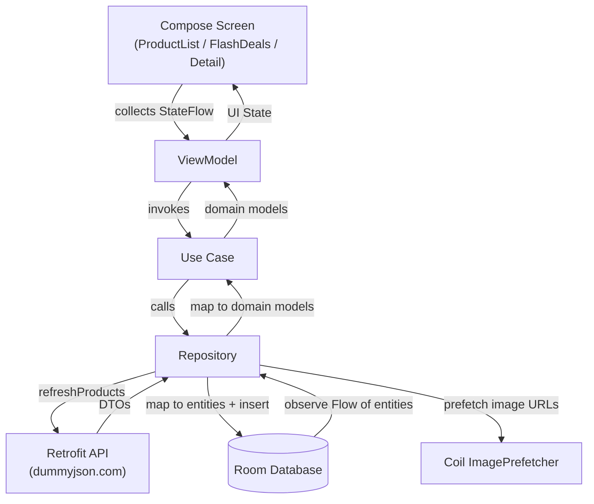
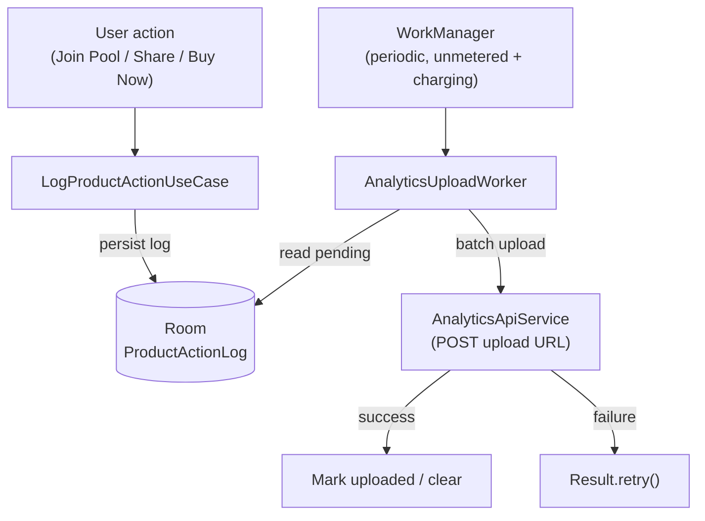

# MarketPlace

A modern Android marketplace app built with Jetpack Compose. It showcases a product catalog with categories, time-limited flash deals with live countdowns, product detail screens, and offline-first data backed by Room. User interactions (join pool, share, buy now) are logged locally and uploaded in batches via a background worker.

## Features

- **Product catalog** — browse products grouped by category with shimmer loading placeholders.
- **Flash deals** — dedicated screen for discounted products with a live countdown timer that resets at the end of each day.
- **Product details** — full product view with product image, pricing, discount, availability, savings, share, and action buttons (Buy Now / Join Pool).
- **Offline-first** — products and categories are fetched from the network and cached in a Room database; the UI observes the local database as the single source of truth.
- **Image prefetching** — product and category images are prefetched with Coil for smooth scrolling.
- **Analytics batching** — product actions are persisted locally and uploaded periodically by a WorkManager worker (only on unmetered networks while charging).

## Tech Stack

- **Language:** Kotlin 
- **UI:** Jetpack Compose + Material 3
- **Architecture:** MVVM with a Clean Architecture-style separation (presentation / domain / data)
- **Dependency Injection:** Dagger Hilt
- **Navigation:** Navigation Compose with type-safe routes (Kotlinx Serialization)
- **Networking:** Retrofit + OkHttp (logging interceptor) + Gson
- **Local storage:** Room
- **Background work:** WorkManager (with Hilt integration)
- **Async:** Kotlin Coroutines + Flow
- **Images:** Coil
- **Testing:** JUnit4, MockK, Coroutines Test, Room in-memory database, AndroidX Test

## Architecture

The app follows a layered architecture under `com.puneet.marketplace`:

```
presentation/   UI layer — Compose screens, components, ViewModels, UI state, navigation
domain/         Business logic — models, use cases, repository interfaces
data/           Data layer — Room (local), Retrofit (remote), repositories, mappers, workers
di/             Hilt modules — Network, Database, Repository, Image
```

Data flow: ViewModels expose UI state from use cases, which read from repositories. Repositories fetch from the remote API, persist to Room, and expose `Flow`s from the database so the UI stays reactive and offline-capable.

## Workflow

### Offline-first data flow



The database is the single source of truth: the network refresh writes into Room, and the UI only ever observes Room via `Flow`, so cached data renders instantly and updates reactively.

### Analytics batching flow



User interactions are recorded locally first, then uploaded in batches by a background worker. Uploads only run on unmetered networks while charging, and failed uploads are retried automatically.

### Key components

- `MarketPlaceApplication` — Hilt application; configures the Coil `ImageLoader` and schedules the periodic analytics upload.
- `MainActivity` — single-activity host with a Compose `Scaffold` and top app bar that adapts per route.
- `MarketPlaceNavHost` — defines navigation between the product list, flash deals, and product detail screens.
- `ProductRepositoryImpl` — refreshes products/categories from the API, caches them in Room, and prefetches images.
- `FlashDealCountdownManager` — shared countdown state for flash deals.
- `AnalyticsUploadWorker` — uploads pending product action logs in batches and retries on failure.

## Testing

The project includes both JVM unit tests and on-device instrumentation tests.

### Unit tests (`app/src/test`)

Fast JVM tests that mock collaborators with [MockK] and drive coroutines with a `MainDispatcherRule` + `kotlinx-coroutines-test`. Shared fixtures live in `TestData.kt`.

- `ProductRepositoryImplTest` — verifies network refresh maps DTOs to entities, derives category thumbnails, prefetches images, and exposes Room data as domain models.
- `ProductActionLogRepositoryImplTest` — logging, querying, and clearing of product action logs.
- `ProductViewModelTest`, `ProductDetailViewModelTest`, `FlashDealsViewModelTest` — UI state emissions and user-action handling.

### Instrumentation tests (`app/src/androidTest`)

Room DAO tests that run against an in-memory database on an emulator/device.

- `ProductDaoTest` — product queries (catalog vs. flash deals, category filtering), upsert-on-conflict, and the `List<String>` type converter round-trip.
- `CategoryDaoTest`, `ProductActionLogDaoTest` — category and action-log persistence.

### Running tests

```bash
# Unit tests (JVM)
./gradlew testDebugUnitTest

# Instrumentation tests (requires a connected device/emulator)
./gradlew connectedDebugAndroidTest
```

[MockK]: https://mockk.io/

## Data Sources

- **Products & categories:** [DummyJSON](https://dummyjson.com/) (`https://dummyjson.com/`)
- **Analytics upload:** a configurable endpoint defined in `AnalyticsEndpoints.kt` (currently a webhook.site test URL — replace with your own backend).

## Project Requirements

- Android Studio (latest stable recommended)
- JDK 17
- Android SDK: `compileSdk` / `targetSdk` 36, `minSdk` 25

## Configuration

- **API base URL** is set in `di/NetworkModule.kt` (`BASE_URL`).
- **Analytics upload URL** is set in `data/remote/AnalyticsEndpoints.kt`. Update it to point at your own analytics backend.

## Package Structure

```
app/src/main/java/com/puneet/marketplace/
├── application/      MarketPlaceApplication
├── data/
│   ├── image/        Coil image prefetcher
│   ├── local/        Room database, DAOs, entities
│   ├── mapper/       DTO/Entity/Domain mappers
│   ├── remote/       Retrofit API services, DTOs, endpoints
│   ├── repository/   Repository implementations
│   └── worker/       WorkManager workers
├── di/               Hilt modules
├── domain/           Models, use cases, repository interfaces
├── presentation/
│   ├── navigation/   NavHost and routes
│   ├── state/        UI state holders
│   ├── ui/           Screens and reusable components
│   └── viewmodel/    ViewModels
├── ui/theme/         Compose theme and colors
├── util/             Extensions and helpers
└── MainActivity.kt

app/src/test/    JVM unit tests (repositories, ViewModels) — MockK + coroutines-test
app/src/androidTest/    Instrumentation tests (Room DAOs) — in-memory database
```
